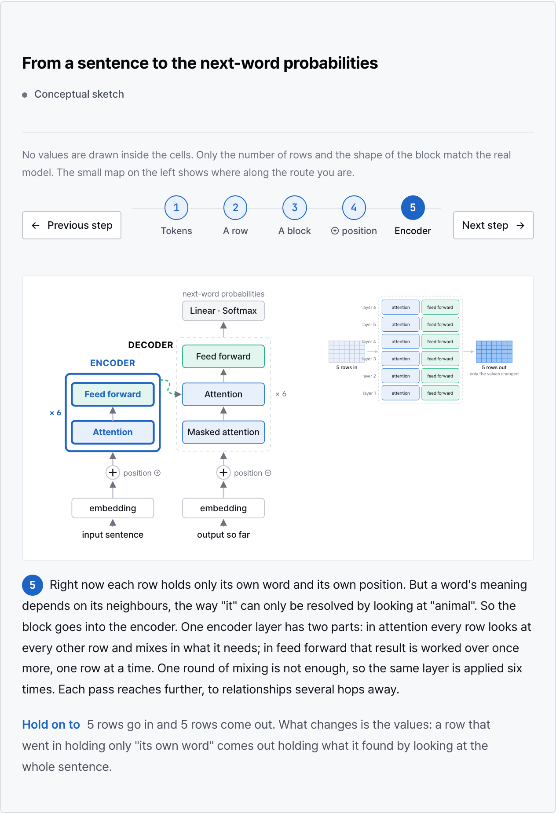
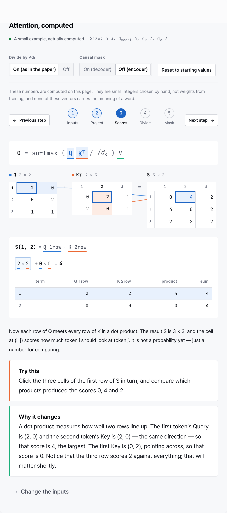
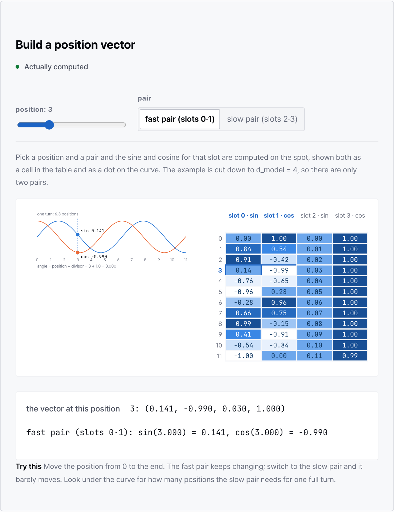

# LLM Visual Lab

A walkthrough of *Attention Is All You Need* with the math done on the page.
Small examples, every number computed live, controls where a picture alone is not enough.
Korean and English.



## What's covered

The whole paper, in reading order: the problem with reading one word at a time, the
overall architecture, vectors and matrix products, dot product, softmax, attention on a
3-token example, multi-head attention, positional encoding, feed-forward / residual /
layer norm, training, beam search, results and ablations.

Math is introduced where the paper first needs it. No linear algebra is assumed.

## Try it

The attention lab computes equation (1) from inputs you can edit. Click a result cell to
see which row and column produced it and the products that add up to it.



Other things you can move: the position and pair in positional encoding, the probability
on the right word and ε in the loss, γ and β in layer norm, the residual bypass on/off
across six layers, beam width, the language pair in the results table.



Works in light and dark, on phones, and reads without JavaScript (the static build
includes the default state of every experiment).

## Run

```bash
npm install
npm run dev          # http://localhost:4321/llm-visual-lab/
npm run build
npm run preview

npm test             # math (vitest)
npm run typecheck
npx playwright install chromium && npm run test:e2e
```

## Layout

- `src/content/docs/{ko,en}/index.mdx` – the page text
- `src/lib/math/` – pure functions; everything on screen comes from these
- `src/components/lab/` – React experiments
- `src/components/site/` – SVG figures, rendered at build time from the same math
- `src/lib/i18n/` – strings in both languages
- `src/lib/paper.ts` – numbers transcribed from the paper (the only ones not computed here)
- `tests/unit/`, `tests/e2e/` – math against numpy-generated fixtures; browser checks at desktop and phone width

## Paper

Vaswani et al., *Attention Is All You Need*, [arXiv:1706.03762](https://arxiv.org/abs/1706.03762) (v7).
`docs/papers/` lists which parts are worked through and which are only named.
